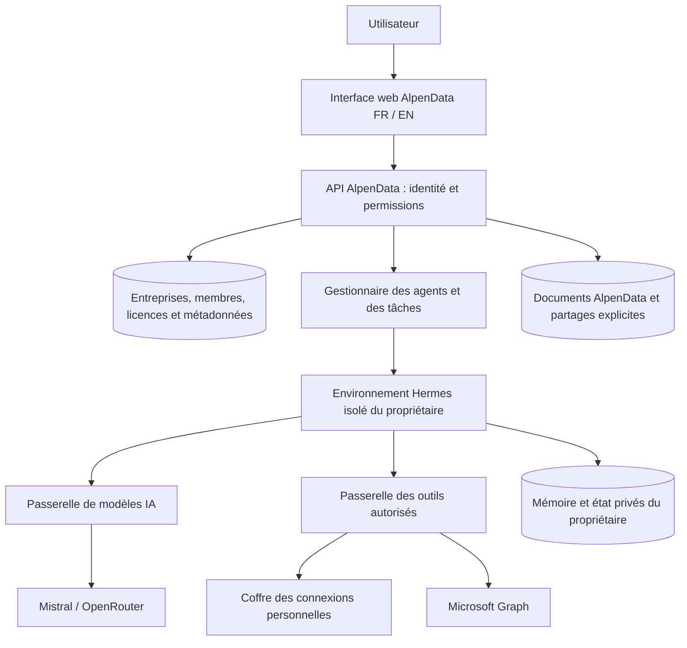

# Architecture proposée pour AlpenData

5 septembre 2026 — proposition technique issue du cahier des charges 1.0 et de l’audit initial. Les composants décrits ici restent à implémenter et à vérifier.

## Structure générale

Conserver le moteur Hermes dans le fork et construire une couche AlpenData qui porte les comptes, les autorisations, les connexions et l’expérience entreprise.

Le gestionnaire transmet une identité d’exécution établie côté serveur. Les identifiants d’entreprise, de propriétaire et de connexion ne sont jamais acceptés comme preuve d’autorisation simplement parce qu’ils figurent dans un message du modèle.

## Choix de composants

| Composant | Orientation proposée | Motif |
| --- | --- | --- |
| Interface client | React et TypeScript dans une surface AlpenData du fork | Cohérence avec les composants existants ; parcours de discussion sans terminal. |
| API métier | Service Python/FastAPI distinct des routes d’administration Hermes | Réutilisation de compétences et bibliothèques, avec une frontière d’autorisation explicite. |
| Données métier | PostgreSQL | Relations entreprise/membre/propriétaire, contraintes et transactions pour les licences et exécutions. |
| État Hermes | Répertoire et magasin propres à chaque utilisateur | Conserver le comportement du moteur sans partager son état entre salariés. |
| Documents | Stockage objet privé avec accès contrôlé par l’API | Téléchargement, versions et partage explicite. |
| Connexions | Coffre côté serveur et passerelle d’outils | Les jetons durables ne sont pas transmis au modèle ou aux commandes qu’il exécute. |
| Exécution pilote | Services métier séparés des machines d’exécution ; environnement conteneurisé propre à chaque utilisateur | Limiter les données accessibles à un agent et rendre l’arrêt/reprise explicite. |
| Hébergement | Infomaniak Public Cloud | Respect du choix du projet ; dimensionnement et services exacts à confirmer. |

Infomaniak documente des instances, du stockage et une offre Kubernetes managée en Suisse. Kubernetes est une option de croissance, dont l’usage dépendra des besoins d’exploitation ; il n’est pas nécessaire de le rendre obligatoire avant le pilote. [Infomaniak — Kubernetes et Public Cloud](https://www.infomaniak.com/en/hosting/public-cloud/kubernetes)

## Identités et autorisations

Pour le pilote M365, proposer « Continuer avec Microsoft » pour l’accès à AlpenData. La connexion à l’application et le consentement aux outils restent deux étapes distinctes, même si Microsoft peut rendre leur enchaînement fluide. Conserver un modèle interne d’identité qui permettra d’autres méthodes de connexion ultérieurement.

Le tenant Microsoft et l’espace entreprise AlpenData sont deux identifiants distincts. Une adresse e-mail ou son domaine ne suffit pas à attribuer un rôle administrateur ou à rattacher automatiquement un compte à une entreprise. Les invitations doivent être limitées à leurs destinataires et expirer.

Chaque action vérifie : session authentifiée, adhésion active à l’entreprise, rôle, propriétaire ou partage explicite, permission métier, connexion active et droits sur la source. Le même contrôle s’applique aux conversations, téléchargements, recherches, WebSockets, tâches et exports.

Les règles de l’administrateur peuvent réduire les capacités d’un collaborateur, sans lui accorder l’accès à sa mémoire ou à ses comptes. L’exploitation AlpenData doit disposer d’un processus distinct pour tout accès exceptionnel au contenu ; ce rôle n’est pas un rôle client ordinaire.

## Modèle de données minimal

| Entité | Données et relations principales |
| --- | --- |
| Entreprise | Identifiant interne, nom, paramètres et politique d’actions. |
| Utilisateur / identité | Identifiant interne ; fournisseur et sujet d’authentification vérifiés. |
| Membre | Entreprise, utilisateur, rôle, état et licence. |
| Onboarding | Entreprise, utilisateur, langue, réponses, étape et propositions. |
| Connexion | Entreprise, propriétaire, fournisseur, compte externe vérifié, permissions, état, référence au coffre. |
| Conversation / exécution | Entreprise, propriétaire, agent, état, références de sources et événements. |
| Automatisation | Entreprise, propriétaire, définition versionnée, calendrier, connexions et autorisations. |
| Action externe | Exécution, paramètres normalisés, validation, identifiant de tentative et résultat connu ou incertain. |
| Document / partage | Entreprise, propriétaire, emplacement, version, provenance, destinataires explicites. |
| Consommation | Entreprise, utilisateur, exécution, fournisseur/modèle, quantités et version du tarif applicable. |

Employer des contraintes de relations cohérentes avec l’entreprise et des contrôles d’accès au niveau de l’API. Une politique de filtrage des lignes en base peut compléter ces contrôles ; son comportement avec les connexions réutilisées et les tâches de fond devra être testé.

## Environnement d’un agent

- Un environnement actif appartient à un seul couple entreprise/utilisateur. L’image logicielle peut être commune ; les volumes d’état ne le sont pas.
- Le conteneur ne monte ni les données de ses voisins, ni les secrets de l’API métier, ni un socket d’administration de l’hôte.
- Exécution sans privilèges ; limitation des ressources ; réseau sortant dirigé vers les passerelles autorisées. L’accès au navigateur et à Internet devra respecter les mêmes contrôles pour empêcher un contournement des permissions d’outils.
- Un administrateur client ne choisit pas librement les chemins, variables d’environnement ou serveurs internes utilisés par les agents.
- Les sous-agents éventuels héritent du propriétaire et de permissions égales ou plus restreintes. Ils ne choisissent pas une autre identité.
- Un conteneur reste une frontière à vérifier, avec un noyau partagé. Évaluer une VM dédiée lorsque le niveau d’isolation demandé l’exige ; les tests d’accès croisés seront réalisés sur le déploiement Linux retenu.

Les commandes de terminal internes nécessaires à la production de documents s’exécutent dans cet environnement. Elles ne doivent pas disposer d’un moyen alternatif d’envoyer des e-mails ou de lire des comptes Microsoft en dehors de la passerelle autorisée.

## Connexion Microsoft et outils

Utiliser un accès délégué par utilisateur. Le serveur associe la réponse OAuth à la session, à l’entreprise et au compte attendu ; il vérifie notamment l’état de la demande et les éléments d’identité avant l’enregistrement. Utiliser une bibliothèque Microsoft et PKCE, avec stockage des jetons côté serveur. [Microsoft — flux d’accès utilisateur](https://learn.microsoft.com/en-us/graph/auth-v2-user)

Commencer par les permissions de lecture nécessaires à la messagerie, à l’agenda et aux documents choisis. Demander les permissions d’écriture ou d’envoi lorsqu’une fonction les nécessite. La liste exacte des permissions et les consentements administrateur sont à confirmer sur les API effectivement utilisées.

La passerelle expose des actions structurées, par exemple rechercher des e-mails, lire un document ou préparer un brouillon. Elle retrouve elle-même la connexion du propriétaire ; elle n’accepte pas une URL arbitraire accompagnée d’un jeton. Les liens de pagination doivent rester dans les destinations validées. Les liens de téléchargement temporaires seront traités séparément sans leur transmettre automatiquement les en-têtes d’authentification Graph.

Lors d’une révocation : marquer la connexion inactive, empêcher immédiatement les nouveaux appels autorisés par AlpenData, invalider les caches correspondants et suspendre les tâches dépendantes. Un appel déjà accepté par un service externe peut avoir abouti ; l’interface doit le signaler si son résultat est incertain.

## Mémoire, recherche et partage

Conserver la mémoire privée dans l’environnement de son propriétaire. Les connaissances partagées passent par un service de ressources commun, contrôlé à chaque recherche et téléchargement.

La consultation et la correction personnelles sont implémentées dans l'interface et utilisent le véritable magasin mémoire Hermes du propriétaire, sous verrou d'exécution. Elles n'appellent pas le modèle et prennent effet dans les nouvelles conversations. Le retrait d'une licence ne retire pas le contrôle de cette mémoire à un membre actif. Voir [Mémoire personnelle](MEMOIRE_PERSONNELLE.md) pour les limites de l'effacement et les garanties de concurrence.

Pour le pilote, privilégier une recherche sur les sources avec les droits courants de l’utilisateur. Tout index ou cache futur devra inclure l’entreprise, l’utilisateur ou les droits applicables, la source et sa version. Une révocation doit invalider les résultats concernés ; une nouvelle requête ne doit pas restituer un document perdu via un ancien cache.

Les copies téléchargées, résumés déjà produits et souvenirs dérivés d’une source posent une question de conservation distincte : leur sort après révocation doit être défini et testé. Ne pas promettre une suppression rétroactive de toutes les connaissances dérivées sans avoir implémenté leur traçabilité.

## Planification, validations et doublons

Décision actualisée le 6 septembre 2026 : PostgreSQL est l’unique autorité de planification et inscrit chaque occurrence dans la file AlpenData. Le véritable Hermes exécute chaque occurrence dans une session et un conteneur du propriétaire. Le magasin cron modifiable par l’agent ne porte pas le consentement de l’utilisateur. Cette évolution de la proposition initiale, ses motifs et ses garanties sont détaillés dans [Automatisations](AUTOMATISATIONS.md). Avant chaque appel métier, la passerelle revérifie les droits courants, même si la tâche a été créée auparavant.

L’activation d’une routine passe par : proposition, essai, lecture du résultat, choix de fréquence et activation. Une autorisation d’action est liée à une définition et à des paramètres explicites ; une modification significative exige de réévaluer la validation.

Pour une action externe, conserver un identifiant de tentative et son état. Après un délai réseau, ne pas supposer l’échec d’un envoi : classer le résultat comme incertain et tenter une réconciliation. Les garanties d’idempotence dépendent du service appelé ; une nouvelle tentative aveugle peut créer un doublon.

## Modèles, facturation et exploitation

La passerelle IA sélectionne uniquement les fournisseurs et modèles configurés par AlpenData, relève la consommation et garde les clés du fournisseur hors de l’environnement d’exécution. Tout changement de fournisseur de secours respecte les destinations de traitement autorisées.

Stripe recevra les événements de facturation après définition des tarifs. La conception détaillée des abonnements et du surusage sera traitée dans le lot dédié, avec simulation des paiements avant tout usage réel.

Prévoir sauvegardes séparées des données métier et des états utilisateurs, restauration testée, journaux sans jetons ni corps de messages privés par défaut, suivi des tâches en erreur et déploiements versionnés. Aucune mise à jour automatique depuis `upstream/main` en production : construire une version AlpenData et vérifier les parcours concernés avant déploiement.

## Critères qui conditionnent le premier accès client

1. Un compte ne peut consulter ou actionner aucune ressource privée d’un autre utilisateur ou d’une autre entreprise, y compris en modifiant les identifiants côté navigateur.
2. Un agent et ses outils ne peuvent lire les volumes de leurs voisins ni appeler une connexion étrangère.
3. Une connexion révoquée bloque une tâche déjà planifiée au prochain contrôle d’action.
4. Un message reçu ou document lu ne peut transformer son contenu en autorisation d’envoi ou en accès administratif.
5. Les scénarios sont vérifiés sur Linux avec le transport réel et des comptes Microsoft de test. Le diagnostic local initial ne remplace pas ces vérifications.
